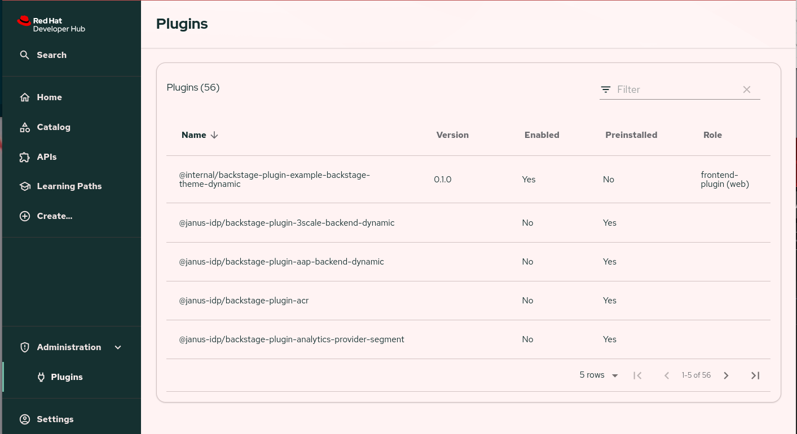
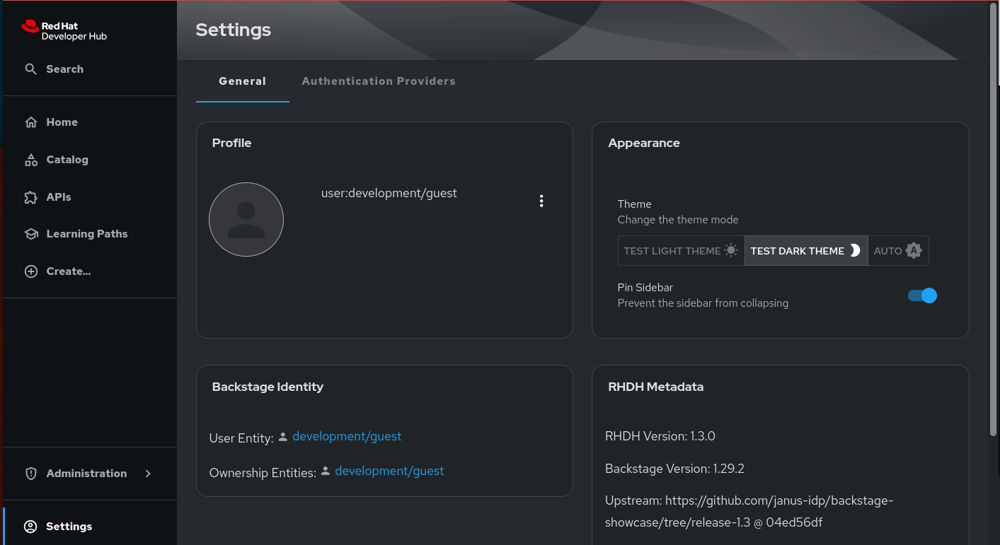

# An example theme for Red Hat Developer Hub

## Overview

> Note: The Dynamic Plugin functionality is a tech preview feature of Red Hat Developer Hub and is still under active development.  Aspects of developing, packaging and deployment of dynamic plugins are subject to change

As of Red Hat Developer Hub 1.3 themes can be added from dynamic plugins, and even the provided themes can be replaced.  This example demonstrates how a theme plugin can be developed in a standalone project and then installed into Developer Hub.  

The theme is contained in a [regular Backstage plugin](plugins/example-backstage-theme/src/plugin.ts#L5-L9) and then exported as a dynamic plugin.  The plugin package exports two theme provider functions, one for the [example light theme](./plugins/example-backstage-theme/src/theme/providers.tsx#L6-L8) and a second for the [example dark theme](./plugins/example-backstage-theme/src/theme/providers.tsx#L10-L12).

The theme itself is a modified version of [this example](https://github.com/backstage/demo/blob/7e86905ff207af3391511ffe38543a9c331090d0/packages/app/src/theme/aperture.ts) that makes a few changes to the Developer Hub UI, most notably aggressively rounded corners sprinkled throughout the UI.  This package also shows how to use [custom typography](plugins/example-backstage-theme/src/theme/consts.ts#L10-L43) and [component overrides](./plugins/example-backstage-theme/src/theme/componentOverrides.ts) as part of the theme.

Finally here's some technical background of how this all works.  The theme is loaded by updating the Developer Hub frontend configuration to add the `theme` property to the plugin's `frontend` configuration.  This informs the Developer Hub frontend of the theme's existence, and the configuration is used to build the structure expected by the `theme` parameter of the Backstage `createApp` call.

## Prerequisites

* node 20.x (node 18 may work fine also but untested)
* npm (10.8.1 was used during development)
* yarn (at least 3.8.1 is required)

## Building the example

To build the theme plugin and prepare it for deployment run the following commands:

```bash
yarn install
```

```bash
yarn tsc 
```

```bash
yarn build
```

```bash
yarn export-dynamic
```

## Running the example

To run the example, first create an `app-config.local.yaml` file with the following contents:

```yaml
auth:
  environment: development
  providers:
    guest:
      dangerouslyAllowOutsideDevelopment: true
dynamicPlugins:
  frontend:
    internal.backstage-plugin-example-backstage-theme:
      appIcons:
        - name: lightIcon
          importName: LightIcon
        - name: darkIcon
          importName: DarkIcon
      themes:
        - id: light  # Using 'light' overrides the app-provided light theme
          title: Test Light Theme
          variant: light
          icon: lightIcon
          importName: lightThemeProvider
        - id: dark  # Using 'dark' overrides the app-provided dark theme
          title: Test Dark Theme
          variant: dark
          icon: darkIcon
          importName: darkThemeProvider
```

Copy the exported dynamic plugin to the available "deploy" directory using the following command:

```bash
cp -R plugins/example-backstage-theme/dist-dynamic deploy/internal.backstage-plugin-example-backstage-theme
```

Then use the supplied script to start an instance of Developer Hub using podman:

```bash
bash ./01-run-example.sh
```

And then open up <http://localhost:7007> in a browser, the theme should be selectable in the settings page.





## Modifying the theme

To develop the theme a small plugin development setup has been added [here](./plugins/example-backstage-theme/dev/index.tsx) with a couple example pages that have components on them.  To run this environment run the following command from the root of this repository:

```bash
yarn dev
```

This should open a browser pointing at <http://localhost:3000> which should contain the first example development page.  This is a live-reload environment, so changes to either the theme or development pages should effect a page refresh automatically.

## Updating the locally deployed plugin

To deploy an updated dynamic plugin with theme modifications, be sure to first run `yarn build` and then `yarn export-dynamic`, and then run these two commands to remove the old plugin export and copy a new one:

```bash
rm -R ./deploy/internal.backstage-plugin-example-backstage-theme
```

```bash
cp -R plugins/example-backstage-theme/dist-dynamic deploy/internal.backstage-plugin-example-backstage-theme
```

And then run or restart the example `01-run-example.sh` script to pick up the newly exported plugin.
